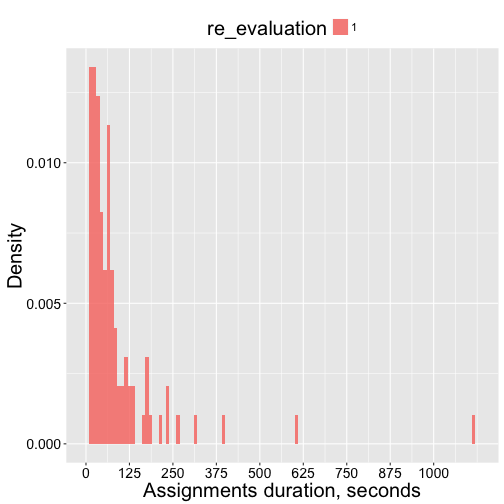
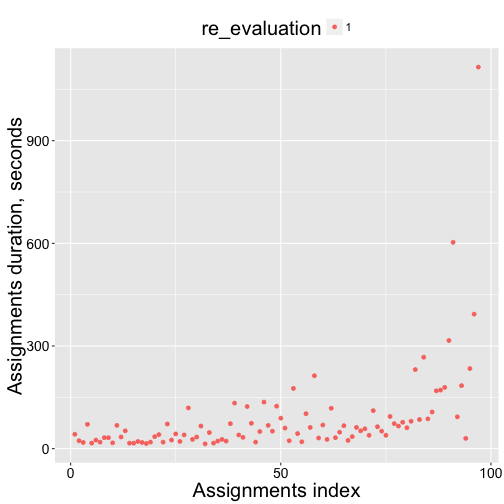
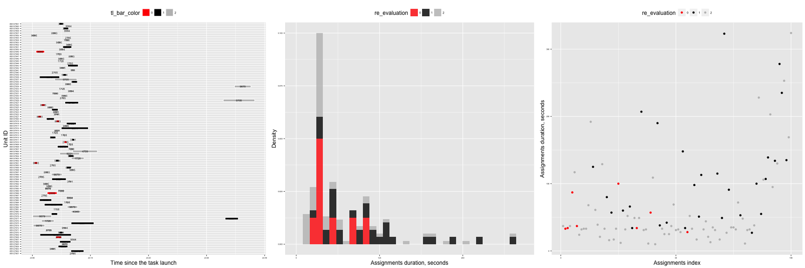
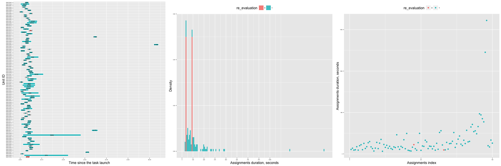
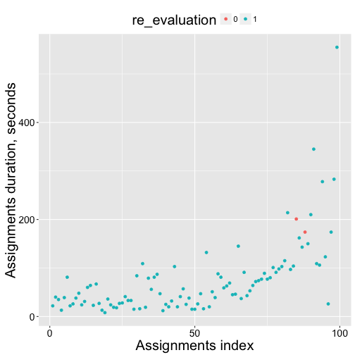

Include libraries and settings


```
## Loading required package: RColorBrewer
## Loading required package: lattice
## 
## Attaching package: 'latticeExtra'
## 
## The following object is masked from 'package:ggplot2':
## 
##     layer
## 
## Loading required package: methods
## Loading required package: bitops
## Loading required package: scales
```

We get a list of links to experiments results:


## Experiments:


```
## [1] "#### ImageLabeling"
```

```
## Scale for 'fill' is already present. Adding another scale for 'fill',
## which will replace the existing scale.
```

```
## NULL
```

```
## Scale for 'fill' is already present. Adding another scale for 'fill',
## which will replace the existing scale.
```

 

```
## NULL
```

```
## Scale for 'fill' is already present. Adding another scale for 'fill',
## which will replace the existing scale.
```

 

```
## NULL
## [1] "#### Transcription"
```

```
## Scale for 'fill' is already present. Adding another scale for 'fill',
## which will replace the existing scale.
```

 

```
## NULL
```

```
## Scale for 'fill' is already present. Adding another scale for 'fill',
## which will replace the existing scale.
```

 

```
## NULL
```

```
## Scale for 'fill' is already present. Adding another scale for 'fill',
## which will replace the existing scale.
```

 

```
## NULL
## [1] "#### BusinessAddress"
```

```
## Scale for 'fill' is already present. Adding another scale for 'fill',
## which will replace the existing scale.
```

 

```
## NULL
```

```
## Scale for 'fill' is already present. Adding another scale for 'fill',
## which will replace the existing scale.
```

 

```
## NULL
```

```
## Scale for 'fill' is already present. Adding another scale for 'fill',
## which will replace the existing scale.
```

  

```
## NULL
```
