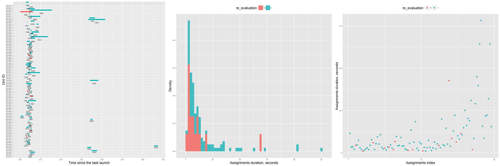
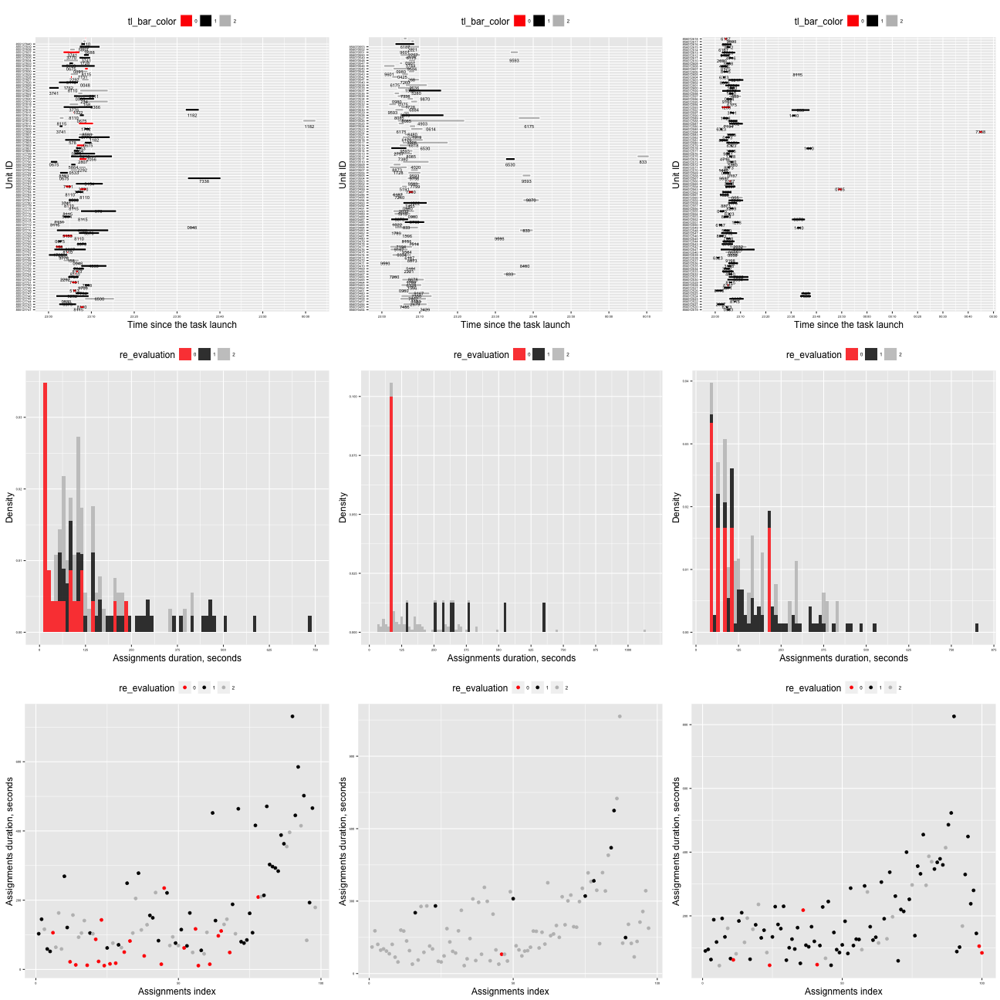
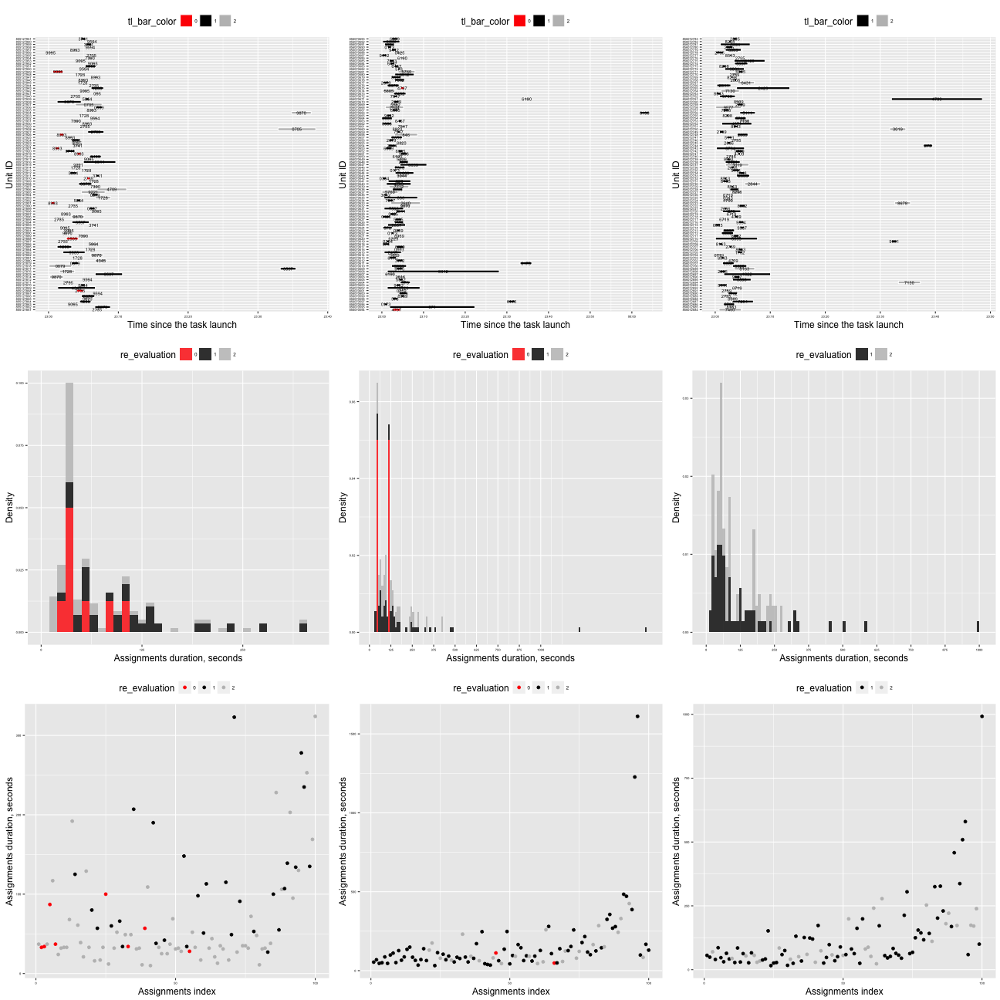
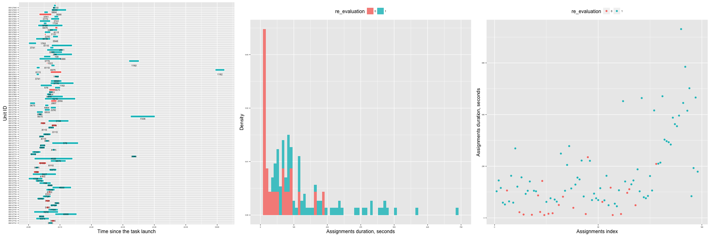

Include libraries and settings


```
## Loading required package: RColorBrewer
## Loading required package: lattice
## 
## Attaching package: 'latticeExtra'
## 
## The following object is masked from 'package:ggplot2':
## 
##     layer
## 
## Loading required package: methods
## Loading required package: bitops
## Loading required package: scales
```

We get a list of links to experiments results:


## Experiments:


```
## [1] "#### ImageLabeling"
## [1] 1
## [1] 2
## [1] 3
## [1] 4
## [1] "#### Transcription"
## [1] 5
## [1] 6
## [1] 7
## [1] 8
## [1] "#### BusinessAddress"
## [1] 9
## [1] 10
## [1] 11
## [1] 12
```

    
