Include libraries and settings


```
## Loading required package: RColorBrewer
## Loading required package: lattice
## 
## Attaching package: 'latticeExtra'
## 
## The following object is masked from 'package:ggplot2':
## 
##     layer
## 
## Loading required package: methods
## Loading required package: bitops
## Loading required package: scales
```

We get a list of links to experiments results:


## Experiments:

          title condition
1 ImageLabeling       1.1
[1] "***"
            title condition
2 ImageLabeling       2.1
[1] "***"
             title condition
3 ImageLabeling       3.1
[1] "***"
             title condition
4 Transcription       1.2
[1] "***"
 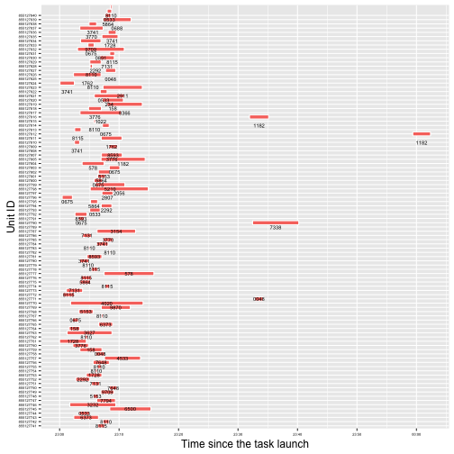 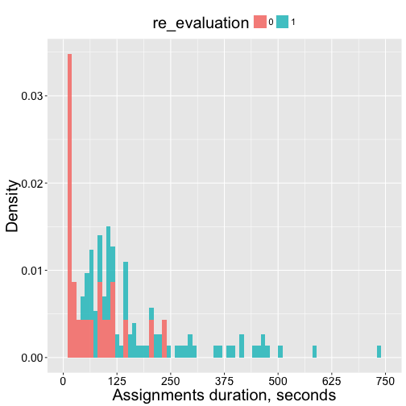           title condition
5 Transcription       2.2
[1] "***"
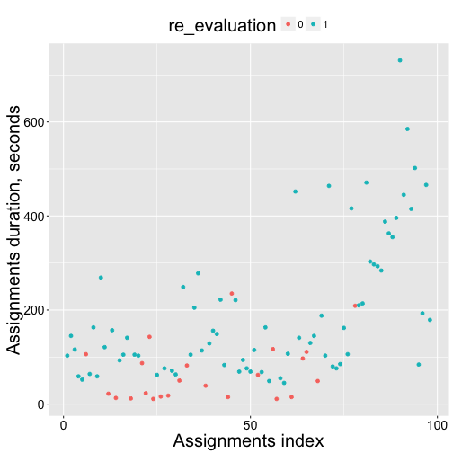 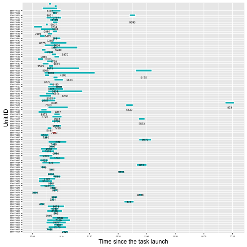 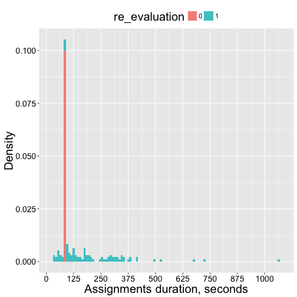           title condition
6 Transcription       3.2
[1] "***"
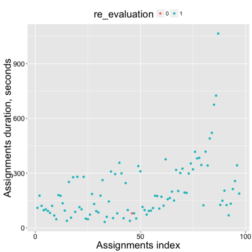 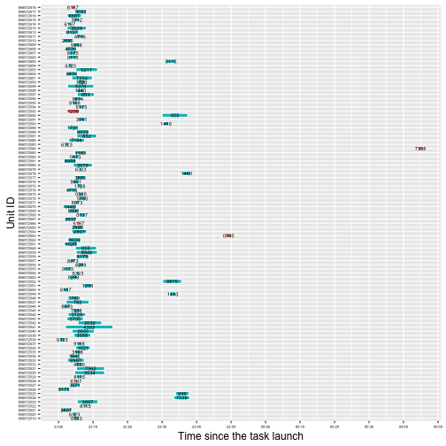              title condition
7 BusinessAddress       1.3
[1] "***"
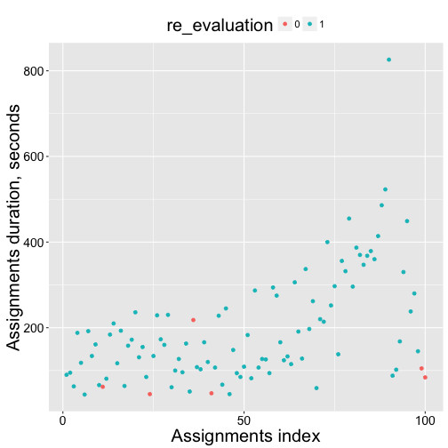 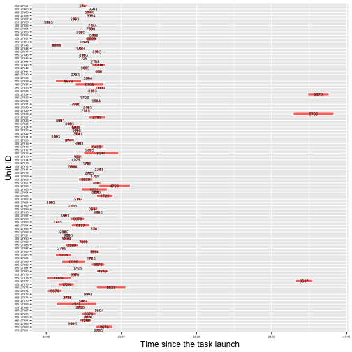 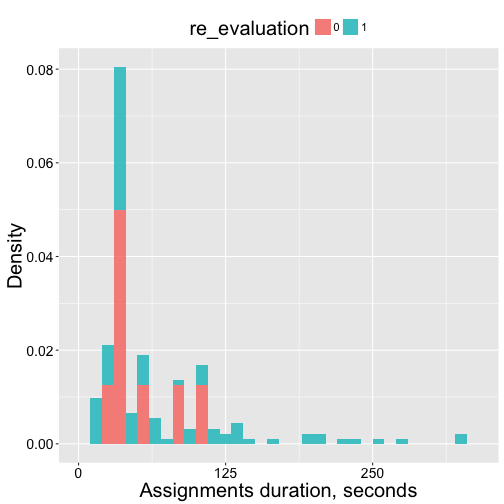             title condition
8 BusinessAddress       2.3
[1] "***"
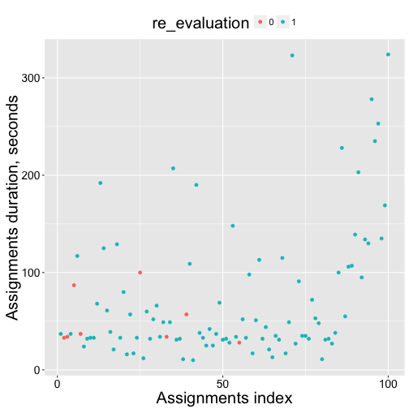 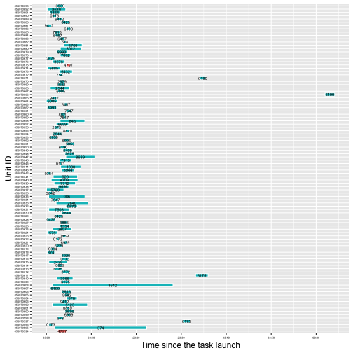 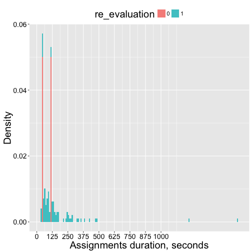             title condition
9 BusinessAddress       3.3
[1] "***"
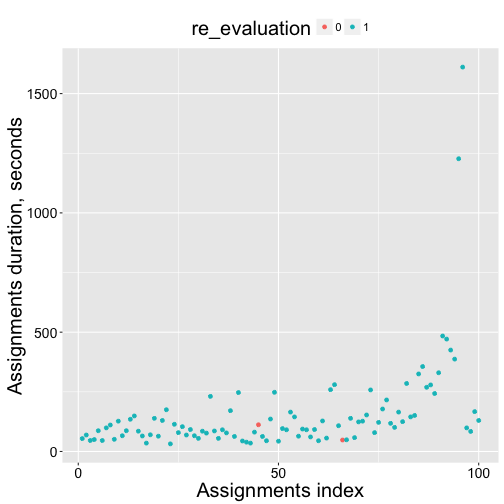 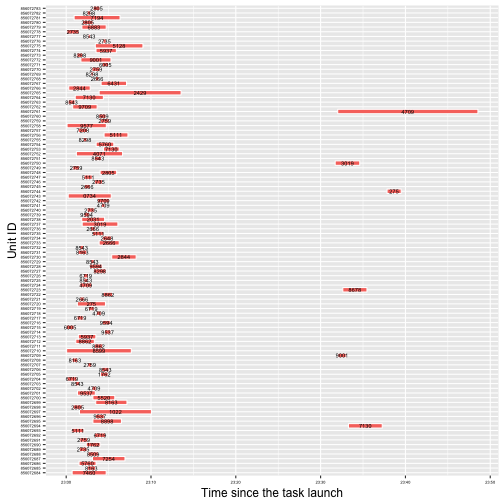 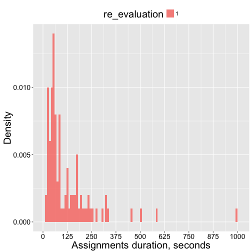 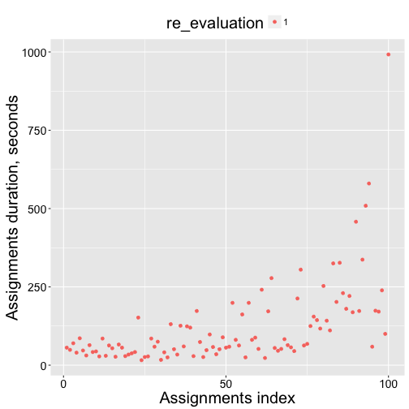 
